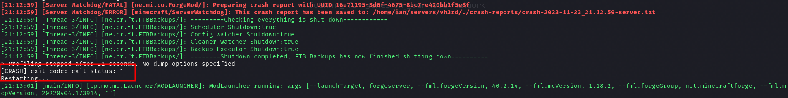

Keep Running
---

Keep running is a quick and easy way to **keep** a process **running** during development or other **non-production** tasks. 

> Please for the love of sanity, do not use this is production...

# Usage

Below you will see the output of the `--help` command. 
Do note that if you don't specify any `--per-*` flag, it defaults to `--per-minute=4`.

```
Usage: kr [OPTIONS] <COMMAND>

Arguments:
  <COMMAND>  

Options:
      --per-minute <PER_MINUTE>  [default: 0]
      --per-hour <PER_HOUR>      [default: 0]
      --delay <DELAY>            [default: 0]
  -h, --help                     Print help
  -V, --version                  Print version
```

# Use cases

## Game servers

/keep-running/ is a great tool to run, for example, a Modded minecraft server. 
As it automatically restarts the server if a crash occurs.



